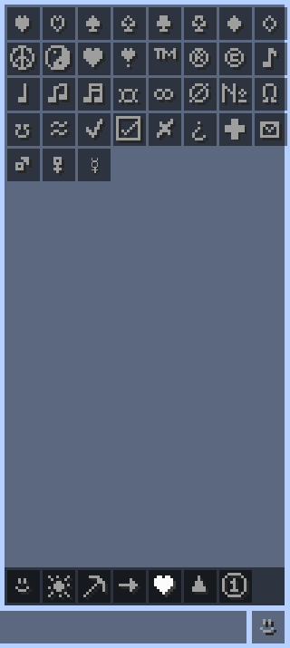
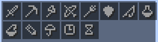
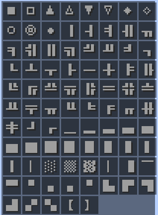
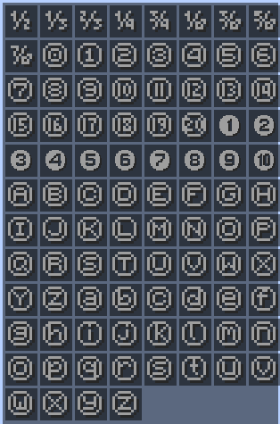

# symbol-chat

This client side mod allows you to paste special characters into the chat, on signs and in the anvil text box.
All symbols are supported by minecraft, meaning everyone can see them, without needing the mod.

## [Download](https://github.com/replaceitem/symbol-chat/releases)

## Config

Some aspects of this mod can be customized in the `symbol-chat.properties` file.

* `hud_color` Background color of the symbol selection hud in hex notation (`#AARRGGBB`)

* `button_color` Color of the button in the symbol selection hud

## Custom symbols

You can specify a list of your own symbols in a `symbols.txt` file in the config directory.
Those will be loaded in the "Custom" symbol category.
You can reload this list by reloading the resourcepacks using F3+T

## Preview

